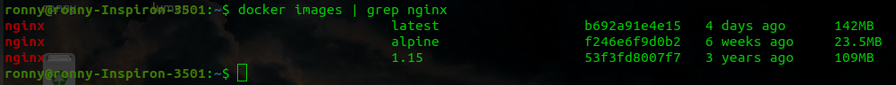
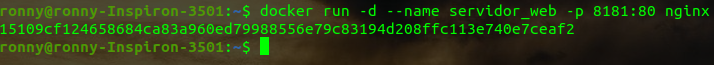
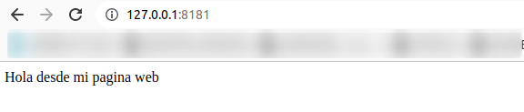
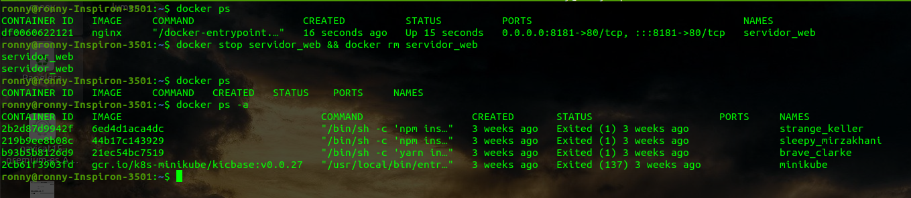

# RETO 1 - DOCKER
## Creando contendor
Verificamos las imagenes de nginx que tiene nuestro registro local
```bash
docker images | grep nginx
```



Creamos el contendor a partir de la imagen de nginx
```bash
docker run -d --name servidor_web -p 8181:80 nginx
```


## Copiando pagina
Copiamos nuestro index.html
```bash
docker cp index.html servidor_web:/usr/share/nginx/html
```

## Pruebas
Realizamos un curl
```bash
curl localhost:8181
```


Tambien verificamos ingresando por el navegador



## Eliminando contendor
Eliminamos el contenedor con el siguiente comando
```bash
docker stop servidor_web && docker rm servidor_web
```
Y listamos los contenedores para verficar
```bash
docker ps -a
```


Como pueden apreciar ya no existe el contenedor