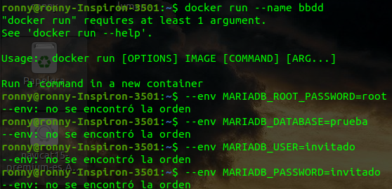
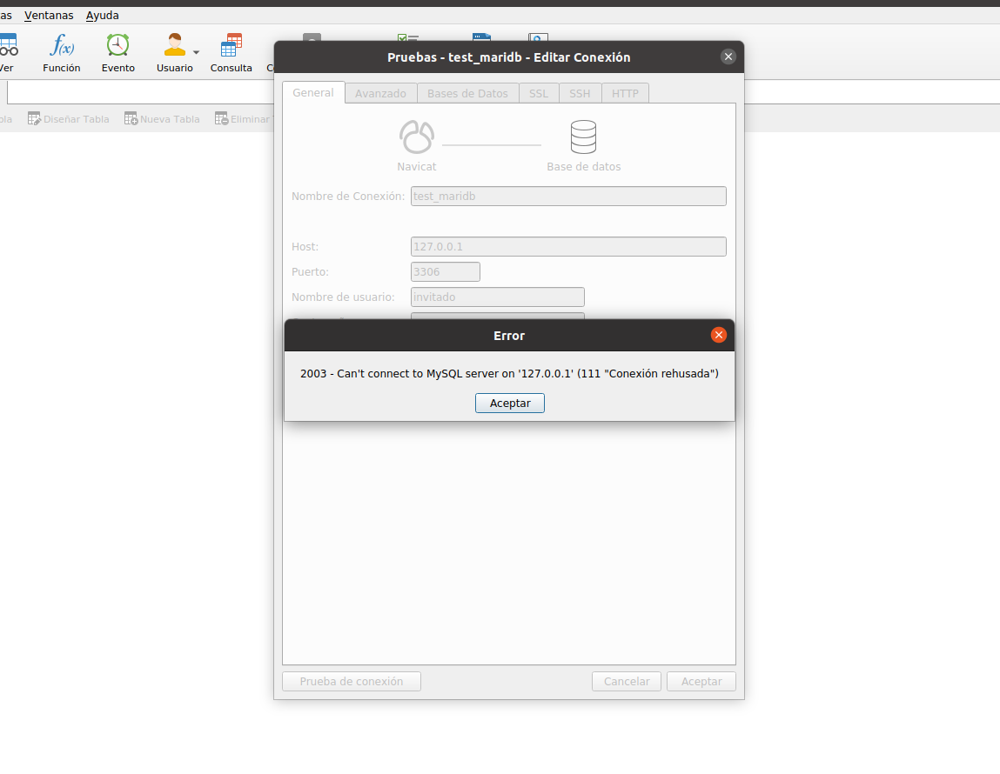

# RETO 2 - DOCKER
Si ejecutamos el comando tal cual lo copiamos, se presentara lo siguiente



Adjuntamos backslash \  al final de cada linea a excepcion de la ultima


Termina de levantar el contenedor y visualizamos el estado del contenedor

Nos percatamos que el puerto en el que trabaja el contenedor no fue mapeado a alguno del host


Lo terminamos de verificar con el inspect y navicat




Modificamos el comando para mapear a un puerto del host
```bash
docker run --name bbdd  --env MARIADB_ROOT_PASSWORD=root  --env MARIADB_DATABASE=prueba  --env MARIADB_USER=invitado --env MARIADB_PASSWORD=invitado -p 3306:3306 mariadb
```


Verificamos el puerto del host


Verificamos la conexion con Navicat


Visualizamos la base de datos que se creó **prueba**


Se intenta eliminar la imagen sin éxito


*Si le pasamos **-f** al eliminar la imagen si lo hace, ya que lo forzamos*

