# RETO 3 - DOCKER
## EJERCICIO
Creamos el volumen 
```bash
docker volume create static_content
```

Creamos la imagen **bootcamp_nginx**, para eso, nos situamos al nivel del **Dockerfile** de la carpeta **reto3**
```bash
docker build -t bootcamp_nginx .
```

Iniciamos el contenedor enlazando el volumen previamente
```bash
docker run -d --name bootcamp_container -v static_content:/usr/share/nginx/html -p 8080:80 bootcamp_nginx 
```

Realizamos un curl para probar
```bash
curl localhost:8080/index.html
```

## AUTOMATIZACIÓN
### PARAMETROS
Este script pueden recibir 5 parametros, siendo solo obligatorio los dos primeros. <br>
A continuación se detalla los parametros<br><br>
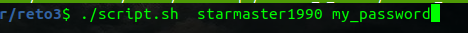
1. Usuario de Dockerhub
2. Password de su usuario de Dockerhub
3. Nombre para la imagen(opcional, por defecto **bootcamp_nginx**)
4. Nombre para el contenedor(opcional, por defecto **bootcamp_container**)
5. Puerto del host al cual se mapeara el del contendor(opcional, por defecto **8080**)
### DETALLE 
El script realiza lo siguiente:
- Valida que los parametros de usuario y password se hayan pasado al script
- Valida la existencia del usuario en DockerHub
- Valida que el nombre del contenedor no este en uso por otro contenedor
- Valida que el puerto no este en uso en el host
- Se autentica en DockerHub
- Se tagea la imagen
- Sube la imagen a la cuenta de Dockerhub

### EXPLICACIÓN 
**VARIABLES Y PARAMETROS SCRIPT**<br>
Tenemos las variables **baseUrlDockerHub** **endpointUsuarios** que forman el endpoint<br>
de dockerHub que permite validar la existencia del usuario<br>
Luego tenemos los parametros de entrada del script. Solo los dos primeros son obligatorios<br><br>
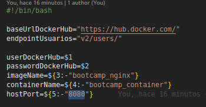

**VALIDACION PARAMETROS NOMBRE Y PASSWORD DOCKERHUB**<br>
Se valida la existencia de los parametros 1 y 2 en el script<br>
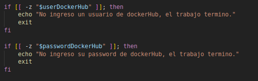

**VALIDACION EXISTENCIA DE USUARIO EN DOCKERHUB**<br>
Con las variables declaradas al inicio del script llamamos al endpoint de dockerHub<br>
La funcion **existsUser** realiza un curl y obtenemos la primera linea de la respuesta y extraemos el codigo de respuesta.<br> Si el codigo es 200 seguimos con el siguiente paso<br><br>
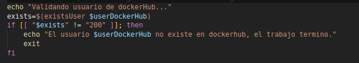<br>
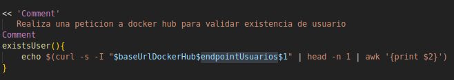

**VALIDACION DISPINIBILIDAD DE NOMBRE DE CONTENEDOR Y PUERTO EN EL HOST**<br>
Validamos que el nombre no este en uso por otro contenedor y que el puerto en el host no este en uso por otro contenedor<br>
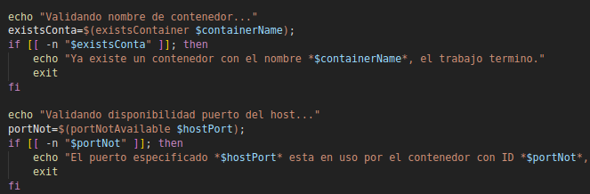<br>

**Funciones usadas**<br>
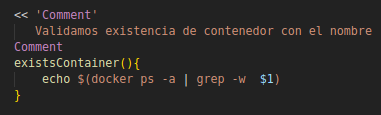<br>
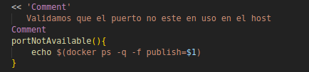

**AUTENTICACION EN DOCKERHUB**<br>
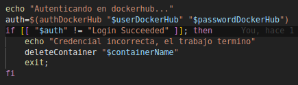<br>
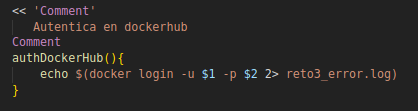

**SUBIENDO IMAGEN A DOCKERHUB**<br>
Crea la imagen<br>
Crea el container<br>
Tagea y sube la imagen a Dockerhub<br>
<br>
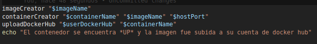<br>
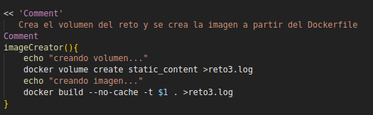<br>
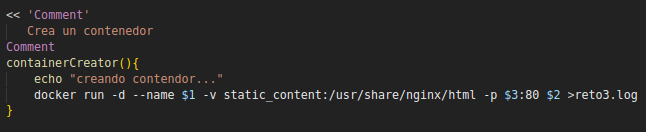<br>
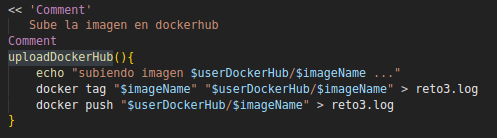

## RESULTADO EJECUCIÓN SCRIPT
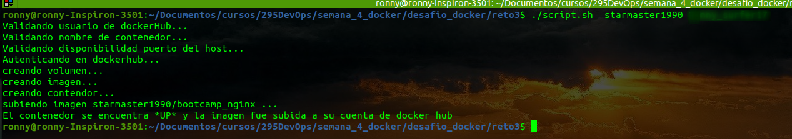

## RESULTADO NAVEGADOR
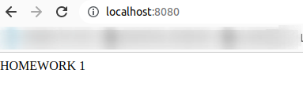


**NOTA** En la ejecucion de ciertos comandos en el script se envia la salida de ejecucicón a archivos .log <br>
Esto es para no ensuciar la salida que vera el usuario al ejecutar el script