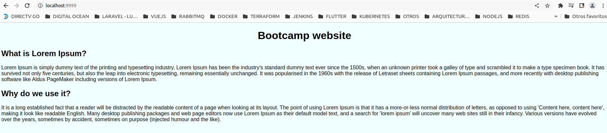

# RETO 3 - DOCKER
Este reto se compone de 3 partes
- El ejercicio mongo
- El ejercicio nginx
- Elminar los contenedores del sistema

Este reto se automatizo con las todas las partes por lo que al finalizar el script no tendra ningun contenedor 
Nota: si desea dejar los contenedores activos comente la ultima seccion 
La automatizacion usa el archivo del **script.sh** del reto y el **glogal.sh**
En este ejerciocio **global.sh** contiene constantes y funciones para diferentes tareas.  
Ej: subir la imagen a dockerhub, validar usuario de dockerhub, etc.
## AUTOMATIZACIÓN
### PARAMETROS
Este script debe recibir 2 parametros obligatorios.  
A continuación se detalla los parametros  

1. Usuario de Dockerhub
2. Password de su usuario de Dockerhub
### DETALLE 
El script realiza lo siguiente:
- Valida que los parametros de usuario y password se hayan pasado al script
- Valida la existencia del usuario en DockerHub
- Valida las credenciales de DockerHub
- Seccion MONGO
    - Crea contenedor
    - Crea BD e inserta informacion en coleccion
    - Crea la imagen desde el contenedor(uso de docker commit)
    - Tagea y sube la imagen a dockerhub
- Seccion MONGO
    - Se valida nombre de contenedor no exista en el host
    - Se valida que el puerto no este en uso por otro contenedor
    - Se crea imagen
    - Se crea contenedor
    - Tagea y sube la imagen a dockerhub
- Se eliminan los contenedores del sistema(parte final del reto)
### EXPLICACIÓN 
**VARIABLES Y PARAMETROS SCRIPT** 
A la derecha tenemos las variables **baseUrlDockerHub** **endpointUsuarios** que forman el endpoint 
de dockerHub que permite validar la existencia del usuario 
A la izquierda tenemos los parametros de entrada del script junto con las variables usadas en el script 
Nombre de imageners, contenedores, etc. 

**VALIDACION CREDENCIALES DOCKERHUB** 
**A la izquierda:**
- Se valida que el script reciba el nombre y passwor de un usuario de dockerhub
- Se valida la existencia del  usuario de dockerhub
- Se valida las credenciales de dockerhub y se inicia sesion

**A la derecha**
Las funciones en **global.sh** que se utilizan 
- existsUser
- authDockerHub
 

**EJERCICIO - MONGO** 

**EJERCICIO - NGINX** 

**EJERCICIO - ELIMINA CONTENEDORES** 

## RESULTADO
 
 
 

**NOTA** En la ejecucion de ciertos comandos en el script se envia la salida de ejecución a archivos .log  
Esto es para no ensuciar la salida que vera el usuario al ejecutar el script